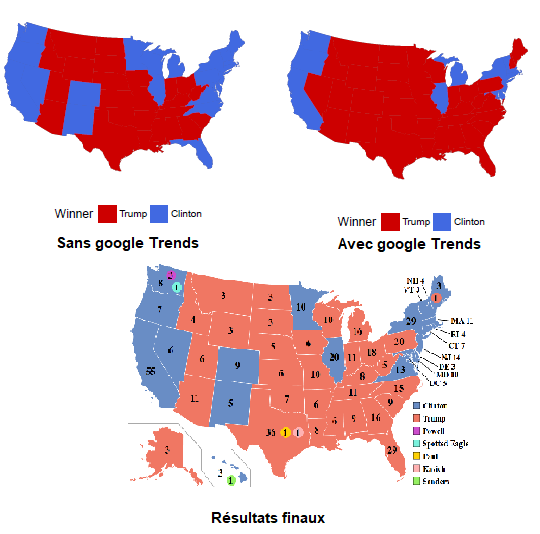

```{r setup, include=FALSE}
knitr::opts_chunk$set(echo = FALSE)
```


# Contexte

## Parcours scolaire

<style type="text/css">
  .reveal p {
    text-align: left;
  }
  .reveal ul {
    display: block;
  }
  .reveal ol {
    display: block;
  }
</style>


* 2013: Intégration ENS, département économie (prépa B/L)
* 2013-2014: L3 Econométrie
* 2014-2015:
  + M1 Economie
  + L3 Maths Appliquées (MASS)
* 2015-2016: 
  + M2 Analyse et Politiques Economiques, Ecole d'Economie de Paris
* 2016-2017: 
  + **ENSAE, 3e année**. Cursus ingénieur, voie *Data Science*, parcours Statistiques et Apprentissage
  + M1 Mathématiques, Jussieu  

## Remarques

Spécificités de mon parcours : 

* 2016: ENSAE encore à Malakoff
* Intégration directe en 3e année

Je reste proche de l'ENSAE:

* prof en 2A, cours Python pour _data-scientists_
et économistes:
* https://linogaliana-teaching.netlify.app/

## Exemple de projets faits à l'ENSAE

* Intégration des *google trends* dans un modèle de prédiction des résultats 
aux présidentielles US de 2016
* Projet de *compressed sensing* pour dissocier partie mouvante et partie fixe d'une vidéo

{width=400px}

# ENSAE: une école d'ingénieur à part

## Syllabus

* Ecole de référence pour les statistiques mathématiques
* Formation reconnue rigoureuse et complète
* Champs reliés: économie, économétrie, sociologie, finance, informatique
* 2e année: année dense en termes de contenu
* 3e année: spécialisation, choix de cours possible
* Cursus principal: voie *Data Science* :
  + *Machine Learning*
  + Stats appliquées

## Niveau à l'entrée

* Début 2A: rattrapage express du contenu 1A en éco, probas, etc. 
  + 1A: mise à niveau des différentes voies
  + Maths: 1A a un contenu proche d'une L3 Maths Appliquées (théorie de la mesure, topologie, initiation à l'informatique)
  + Economie: en 1A premières initiations à l'économie quantitative. Gros du
programme en 2A
* Statistiques: cours principaux en 2A
* Informatique: `Python` et `R` au programme de 2A, `Git` dès la 1A, `LateX`
en 1A
* _Machine Learning_: découverte en 2A, principalement en 3A
  
## Après l'ENSAE


* Profil très recherché, notamment dans la *Data Science*
  + Beaucoup d'offres emploi/stage sur la plateforme d'emploi
* Je n'aurais pas pu faire mes stages voire certains travaux actuels sans la formation rigoureuse de l'ENSAE:
  + Prévision de consommation électrique J+1 à EDF
  + Analyse ségrégation avec données téléphonie mobile
  + Analyse consommation en supermarché avec données de caisse